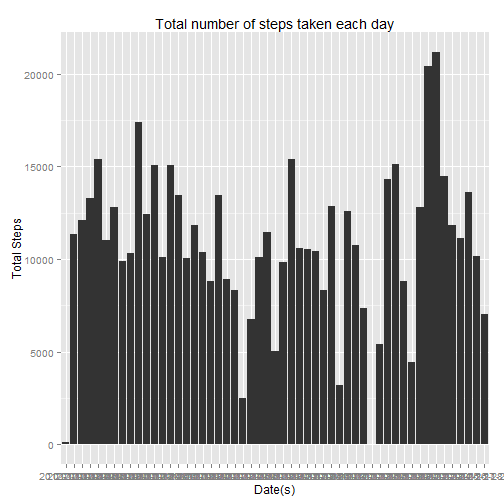
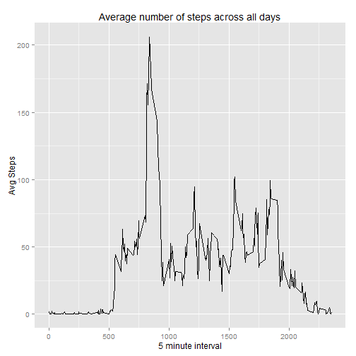
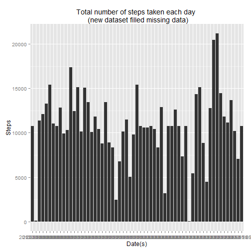

# Reproducible Research: Peer Assessment 1

## Loading and preprocessing the data

```r
library(knitr)
library(ggplot2)
library(sqldf)


# Assume the activity.csv was placed at the same directory as this Rmarkdown
# file.
monitoringData <- read.csv("activity.csv")
cleanedData <- sqldf("Select * from monitoringData where steps is not null")
```


## Create histogram of the total number of steps taken each day


```r

# plot graph
histData <- sqldf("Select date,sum(steps) steps from cleanedData group by date")
qplot(date, steps, data = histData, geom = "histogram") + xlab("Date(s)") + 
    ylab("Total Steps") + ggtitle("Total number of steps taken each day")
```

```
## Mapping a variable to y and also using stat="bin".
##   With stat="bin", it will attempt to set the y value to the count of cases in each group.
##   This can result in unexpected behavior and will not be allowed in a future version of ggplot2.
##   If you want y to represent counts of cases, use stat="bin" and don't map a variable to y.
##   If you want y to represent values in the data, use stat="identity".
##   See ?geom_bar for examples. (Deprecated; last used in version 0.9.2)
```

 

```r

# calculate the mean and median total number of steps taken per day
meanStep = mean(histData$steps)
medianStep = median(histData$steps)

# The __mean__ total number of steps taken per day: _`r meanStep`_ The
# __median__ total number of steps taken per day: _`r medianStep`_
```

## What is the average daily activity pattern?


```r
## create time series plot of the 5-minute interval and the average number of
## steps taken

# calculate the average of steps w.r.t. the time interval
timeSeries <- aggregate(steps ~ interval, cleanedData, mean)

# Plot time series graph
qplot(interval, steps, data = timeSeries, geom = "line") + xlab("5 minute interval") + 
    ylab("Avg Steps") + ggtitle("Average number of steps across all days")
```

 

```r

# check which 5-minute interval contains the maximum number of steps

stepsIntervals <- sqldf("Select interval,max(steps) as steps from timeSeries")
maxInterval <- stepsIntervals[["interval"]]
maxAvgStep <- stepsIntervals[["steps"]]
```

* On average across all the days in the dataset, __835__ 5-minute interval contains maximum number of steps (__206.1698__ steps)


## Imputing missing values

```r
# calulate the total number of missing values in the dataset
totalNARows <- sqldf("Select count(*) from monitoringData where steps is null")
```

* The total number of missing values in the dataset: __2304__


```r

# filling all of the missing values in the dataset STRATEGY: using mean of 5
# minute interval

# get the NA rows
naSteps <- which(is.na(monitoringData$steps))
naInterval <- monitoringData[naSteps, 3]  #get the corrosponding intervale
fillSteps <- sapply(naInterval, function(x) {
    timeSeries[(timeSeries$interval == x), 2]
})

# create a new dataset that is equal to the orginal dataset BUT with the
# missing data filled in
monitoringDataNew <- monitoringData
monitoringDataNew[naSteps, "steps"] = fillSteps  #fill in missing data

# again, calculate the average of steps w.r.t. the time interval
sumStepNew <- aggregate(steps ~ date, monitoringDataNew, sum)
# plot graph
qplot(date, steps, data = sumStepNew, geom = "histogram") + xlab("Date(s)") + 
    ylab("Steps") + ggtitle("Total number of steps taken each day \n (new dataset filled missing data)")
```

```
## Mapping a variable to y and also using stat="bin".
##   With stat="bin", it will attempt to set the y value to the count of cases in each group.
##   This can result in unexpected behavior and will not be allowed in a future version of ggplot2.
##   If you want y to represent counts of cases, use stat="bin" and don't map a variable to y.
##   If you want y to represent values in the data, use stat="identity".
##   See ?geom_bar for examples. (Deprecated; last used in version 0.9.2)
```

 

```r


# calculate the mean and median total number of steps taken per day
meanStepNew <- mean(sumStepNew$steps)
medianStepNew <- median(sumStepNew$steps)
```


### After filling the missing values
* The __mean__ total number of steps taken per day: _1.0766 &times; 10<sup>4</sup>_
* The __median__ total number of steps taken per day: _1.0766 &times; 10<sup>4</sup>_

The mean number of steps taken per day are the same (1.0766 &times; 10<sup>4</sup>). 
But, the median number of steps taken per day are slightly different (before filling missing data: 10765, after filling missing data: 1.0766 &times; 10<sup>4</sup>). It is probably due to filling missing values by the mean of 5 minute interval.

## Are there differences in activity patterns between weekdays and weekends?

```r
# create a new factor variable 'dateIs' with two levels 'Weekday' and
# 'weekend'
monitoringDataNew$date = as.Date(as.character(monitoringDataNew$date), "%Y-%m-%d")
monitoringDataNew["dateIs"] = factor(sapply(monitoringDataNew$date, function(x) {
    if (weekdays(x) == "Sunday" | weekdays(x) == "Saturday") {
        "weekend"
    } else {
        "weekday"
    }
}))

# calculate the average of steps w.r.t. the time interval and dateIs
avgStepDateIs = aggregate(steps ~ interval + dateIs, mean, data = monitoringDataNew)

library(lattice)
xyplot(steps ~ interval | dateIs, data = avgStepDateIs, type = "l", layout = c(1, 
    2), xlab = "Interval", ylab = "Number of steps")
```

 


